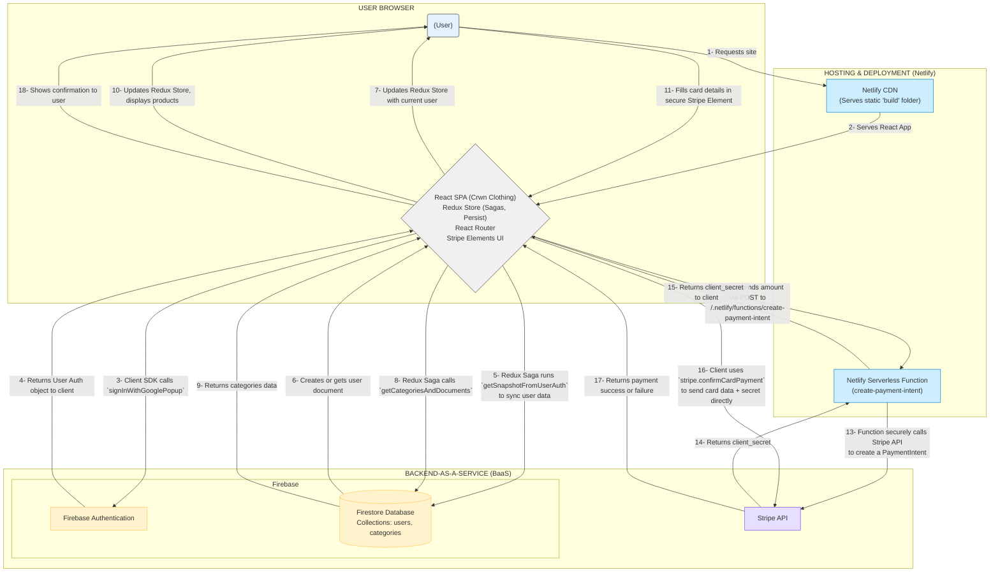

# Crwn Clothing Kartikey - System Architecture

This document outlines the architecture of the Crwn Clothing Kartikey application, including the folder structure, major components, data flow, and key design decisions.

## 1. System Overview

Crwn Clothing Kartikey is a client-server application leveraging a Backend-as-a-Service (BaaS) model with serverless functions for specific backend logic.



- **Client:** A React Single Page Application (SPA) built with TypeScript, running in the user's browser. It handles UI, routing, and local state management.
- **Hosting/CDN:** Static assets (HTML, CSS, JS bundles) are served via Netlify's CDN after building and deployment.
- **Backend Services (BaaS):** Firebase provides Authentication and Firestore database services directly accessed by the client using Firebase SDKs.
- **Serverless Function:** A Netlify Function (`create-payment-intent`) acts as a secure backend microservice specifically for interacting with the Stripe API to create payment intents, preventing exposure of the Stripe Secret Key to the client.
- **Payment Gateway:** Stripe handles the secure processing of credit card payments.

## 2. Folder Structure

The project follows a structure largely based on Create React App, with specific directories for organizing features and logic:

```
crwn-clothing-kartikey/
├── netlify/                  # Netlify specific configuration
│   └── functions/            # Serverless functions (e.g., Stripe integration)
│       ├── create-payment-intent.js
│       └── ...
├── public/                   # Static assets, index.html, manifest.json, PWA assets
├── src/                      # Main application source code
│   ├── assets/               # Images, SVG icons, etc.
│   ├── components/           # Reusable UI components (atomic/molecular level)
│   │   ├── button/
│   │   ├── cart-dropdown/
│   │   ├── sign-in-form/
│   │   └── ...
│   ├── routes/               # Page-level components / Views
│   │   ├── home/
│   │   ├── shop/             # Contains nested routes for categories
│   │   ├── authentication/
│   │   └── checkout/
│   ├── store/                # Redux state management files
│   │   ├── cart/             # Cart specific actions, reducer, selectors, types
│   │   ├── categories/       # Category specific actions, reducer, selectors, saga, types
│   │   ├── user/             # User auth specific actions, reducer, selectors, saga, types
│   │   ├── middleware/       # Custom Redux middleware (e.g., logger)
│   │   ├── root-reducer.js   # Combines all reducers
│   │   ├── root-saga.ts      # Combines all sagas
│   │   └── store.ts          # Redux store configuration (middleware, persist, enhancers)
│   ├── utils/                # Utility functions and helpers
│   │   ├── firebase/         # Firebase initialization and utility functions
│   │   ├── reducer/          # Redux action creator utilities (type safety)
│   │   └── stripe/           # Stripe initialization (publishable key)
│   ├── App.js                # Main application component, sets up routing
│   ├── index.js              # Application entry point, sets up Redux Provider, Router, Stripe Elements
│   ├── global.styles.js      # Global CSS styles via Styled Components
│   ├── service-worker.ts     # PWA service worker logic
│   ├── serviceWorkerRegistration.ts # PWA service worker registration logic
│   └── ... (config files, test setup)
├── .env                      # Environment variables (local development, Gitignored)
├── deploy_project.sh         # Deployment automation script
├── package.json              # Project dependencies and scripts
└── tsconfig.json             # TypeScript compiler configuration
```

## 3. Major Components

- **React UI (components/, routes/):** Leverages functional components, Hooks, TypeScript, and Styled Components for building the user interface. `routes/` define page views, while `components/` contain reusable UI elements.
- **Routing (react-router-dom):** Manages navigation between different views/pages within the SPA. Uses v6 features like nested routes (`shop/*`).
- **State Management (store/):**
  - **Redux:** Centralized store for global application state (user session, cart, categories).
  - **Redux Saga:** Handles asynchronous side effects (API calls to Firebase, auth flows). Sagas listen for specific Redux actions and execute corresponding asynchronous logic.
  - **Redux Persist:** Persists the cart state to `localStorage`.
  - **Reselect:** Creates memoized selectors to efficiently derive data from the Redux state and prevent unnecessary re-renders.
- **Firebase Integration (utils/firebase/):** Provides functions to interact with Firebase Authentication (sign-up, sign-in, sign-out, auth state) and Firestore (fetching categories, reading/writing user data).
- **Stripe Integration (utils/stripe/, components/payment-form/, netlify/functions/):**
  - `stripe.utils.js`: Initializes Stripe.js with the publishable key.
  - `PaymentForm`: Uses Stripe Elements for secure card input.
  - `create-payment-intent.js`: Netlify Function that securely calls the Stripe API using the secret key to create a payment intent.
- **PWA Features (public/, src/service-worker.ts, src/serviceWorkerRegistration.ts):** Includes a manifest file and service worker for basic PWA capabilities like offline caching.

## 4. Data Flow Examples

### User Authentication (Email Sign-In)

1.  **UI (SignInForm):** User enters email/password and clicks "Sign In".
2.  **Event Handler:** `handleSubmit` dispatches `emailSignInStart` action with credentials.
3.  **Redux Saga (user.saga.ts):** `onEmailSignInStart` watcher catches the action, calls `signInWithEmail` saga.
4.  **Saga Worker (`signInWithEmail`):** Calls Firebase util `signInAuthUserWithEmailAndPassword(email, password)`.
5.  **Firebase Util:** Calls Firebase SDK `signInWithEmailAndPassword`.
6.  **Firebase Auth:** Authenticates user. Returns UserCredential on success or throws error.
7.  **Saga Worker:**
    - **On Success:** Calls `getSnapshotFromUserAuth` saga with the `user` object.
      - `getSnapshotFromUserAuth`: Calls Firebase util `createUserDocumentFromAuth` (or just gets existing doc).
      - `getSnapshotFromUserAuth`: Dispatches `signInSuccess` action with user data from Firestore.
    - **On Failure:** Dispatches `signInFailed` action with the error.
8.  **Redux Reducer (user.reducer.ts):** Handles `signInSuccess` (updates `currentUser` in state) or `signInFailed` (updates `error` in state).
9.  **UI Update:** Components subscribed to `currentUser` (via `useSelector` and `selectCurrentUser`) re-render.

### Fetching Product Categories

1.  **UI (Shop Component Mount):** `useEffect` hook dispatches `fetchCategoriesStart` action.
2.  **Redux Saga (category.saga.ts):** `onFetchCategories` watcher catches the action, calls `fetchCategoriesAsync` saga.
3.  **Saga Worker (`fetchCategoriesAsync`):** Calls Firebase util `getCategoriesAndDocuments()`.
4.  **Firebase Util:** Queries the 'categories' collection in Firestore.
5.  **Firestore:** Returns the category documents.
6.  **Saga Worker:**
    - **On Success:** Dispatches `fetchCategoriesSuccess` action with the fetched categories array.
    - **On Failure:** Dispatches `fetchCategoriesFailed` action with the error.
7.  **Redux Reducer (category.reducer.ts):** Handles `fetchCategoriesStart` (sets `isLoading: true`), `fetchCategoriesSuccess` (updates `categories` array, sets `isLoading: false`), or `fetchCategoriesFailed` (sets `error`, `isLoading: false`).
8.  **UI Update:** Components (`CategoriesPreview`, `Category`) subscribed to categories state (via selectors like `selectCategoriesMap`, `selectCategoriesIsLoading`) re-render to display data or loading spinner.

### Processing a Payment

1.  **UI (Checkout Page):** User reviews cart, `PaymentForm` component renders Stripe `CardElement`.
2.  **UI (PaymentForm):** User fills card details and clicks "Pay now".
3.  **Event Handler:** `paymentHandler` prevents default form submission.
4.  **Client-Side JS (`paymentHandler`):**
    - Sets `isProcessingPayment` state to true (shows loading spinner).
    - Makes a `fetch` request to `/.netlify/functions/create-payment-intent` (endpoint handled by Netlify Function), sending the cart total (`amount`).
5.  **Netlify Function (`create-payment-intent.js`):**
    - Receives the `amount`.
    - Uses the **Stripe Secret Key** (from environment variables) to call `stripe.paymentIntents.create({ amount, currency: 'usd', ... })`.
    - Returns the `client_secret` from the created PaymentIntent in the response body.
6.  **Client-Side JS (`paymentHandler`):**
    - Receives the `client_secret` from the Netlify Function response.
    - Calls `stripe.confirmCardPayment(client_secret, { payment_method: { card: cardElement, ... } })`.
7.  **Stripe API:** Processes the payment confirmation using the details associated with the `client_secret` and the card details from `CardElement`. Returns success or error.
8.  **Client-Side JS (`paymentHandler`):**
    - Sets `isProcessingPayment` state to false.
    - Shows success or error message based on `paymentResult`.

## 5. Design Decisions

- **React & TypeScript:** Modern, component-based UI library with added type safety for better maintainability and developer experience.
- **Redux with Saga:** Chosen for managing complex global state and asynchronous operations (auth, data fetching) in a structured and testable manner, suitable for scaling e-commerce features.
- **Firebase BaaS:** Reduces backend development time by leveraging pre-built services for Authentication and Database, allowing focus on the frontend experience.
- **Stripe:** Industry-standard, developer-friendly platform for handling payments securely.
- **Serverless Function (Netlify):** Provides a lightweight, scalable, and secure way to run backend code (like interacting with Stripe's private API) without managing server infrastructure. Decouples payment logic from the main frontend.
- **Styled Components:** Enables component-scoped styling colocated with the component logic, using tagged template literals for a clean syntax and dynamic styling capabilities.
- **Code Splitting (React.lazy/Suspense):** Improves initial page load performance by only loading the JavaScript needed for the current route.
- **Redux Persist:** Enhances user experience by saving the cart state locally.
